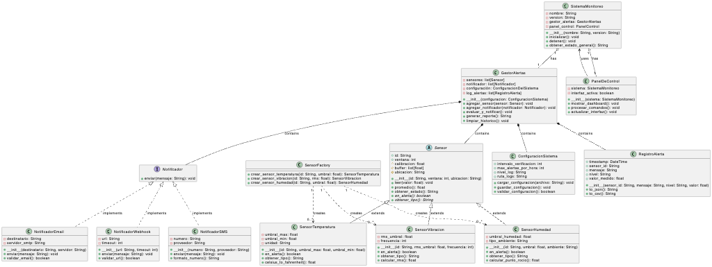

# Sistema de Monitoreo - 4 Pilares OOP

## 📋 Descripción

Este proyecto implementa un sistema completo de monitoreo de sensores que demuestra los **4 pilares fundamentales de la Programación Orientada a Objetos**:

1. **Encapsulación** - Atributos privados y métodos para proteger el estado interno
2. **Herencia** - Clase abstracta `Sensor` con subclases especializadas
3. **Polimorfismo** - Diferentes implementaciones de métodos abstractos y protocolo `Notificador`
4. **Abstracción** - Clase abstracta `Sensor` y protocolo `Notificador`

## 🏗️ Arquitectura

### Elementos UML Implementados:

* ✅ **Clase Abstracta**: `Sensor` con métodos abstractos
* ✅ **Subclases**: `SensorTemperatura`, `SensorVibracion`, `SensorHumedad`
* ✅ **Herencia**: Todas las subclases heredan de `Sensor`
* ✅ **Protocolo/Interface**: `Notificador` define la interfaz común
* ✅ **Composición**: `GestorAlertas` contiene sensores y notificadores
* ✅ **Agregación**: `SistemaMonitoreo` tiene un `GestorAlertas`
* ✅ **Asociación**: `PanelControl` conoce a `SistemaMonitoreo`
* ✅ **Dependencia**: `FactoriaSensores` crea instancias de sensores

### Clases Principales:

1. **Sensor (Abstracta)**: Clase base para todos los sensores
2. **SensorTemperatura**: Monitorea temperatura con umbrales min/max
3. **SensorVibracion**: Detecta vibraciones usando RMS
4. **SensorHumedad**: Controla niveles de humedad
5. **GestorAlertas**: Coordina sensores y notificaciones
6. **SistemaMonitoreo**: Clase principal del sistema
7. **Notificadores**: Email, Webhook, SMS
8. **FactoriaSensores**: Crea sensores usando Factory Pattern

## 🔧 Requisitos

* Python 3.8 o superior
* No requiere librerías externas (solo librerías estándar)

## 📦 Instalación

1. Clona o descarga el proyecto:

bash

```bash
git clone https://github.com/chavarc97/Ejercicio-4-pilares.git
cd sistema-monitoreo
```

2. Verifica que tengas Python instalado:

bash

```bash
python --version
```

## 🚀 Ejecución

### Opción 1: Ejecutar el ejemplo completo

bash

```bash
python notifications.py
```

```
